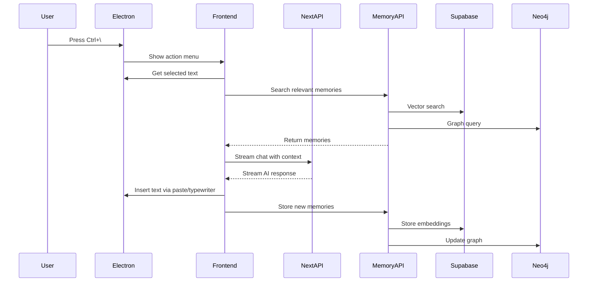

## Overview

Tabby is built as a **hybrid desktop application** that combines Electron, Next.js, and FastAPI to create a system-wide AI keyboard layer. The architecture is designed to be unobtrusive yet powerful, running in the system tray while intercepting keyboard input globally.

<Frame>
  
</Frame>

## Core Components

Tabby consists of four main layers that work together:

<CardGroup cols={2}>
  <Card title="Desktop Layer" icon="desktop">
    Electron 38 application managing system-level features, global shortcuts, and window orchestration
  </Card>
  <Card title="Frontend Layer" icon="window">
    Next.js 15 + React 19 UI with multiple specialized windows and real-time AI streaming
  </Card>
  <Card title="Backend API" icon="server">
    Next.js API routes handling AI completions, chat, search, and MCP integration
  </Card>
  <Card title="Memory Service" icon="brain">
    FastAPI Python service managing persistent memory with Mem0, Supabase, and Neo4j
  </Card>
</CardGroup>

## Architecture Layers

### 1. Electron Main Process

The Electron main process (`frontend/electron/src/main.ts`) orchestrates the entire application:

```typescript
app.whenReady().then(() => {
  createMainWindow();          // Hidden background window
  createTray();                // System tray icon
  initializeContextCapture();  // Screenshot automation
  registerGlobalShortcuts();   // Keyboard hooks
  registerAllIpcHandlers();    // IPC communication
});
```

**Key Responsibilities:**

<AccordionGroup>
  <Accordion title="Window Management">
    Creates and manages specialized windows:
    - **Main Window**: Hidden background window for background tasks
    - **Action Menu**: Quick AI popup triggered by `Ctrl+\`
    - **Brain Panel**: Memory dashboard (`Ctrl+Shift+B`)
    - **Suggestion Window**: Inline AI suggestions
    - **Settings Window**: Configuration and onboarding
  </Accordion>

  <Accordion title="Global Shortcuts">
    Registers system-wide keyboard hooks:
    - `Ctrl+\` - Open action menu
    - `Ctrl+Space` - AI suggestions
    - `Ctrl+Shift+B` - Brain panel
    - `Alt+X` - Interview copilot
    - Custom shortcuts for all features
  </Accordion>

  <Accordion title="Desktop Automation">
    - Clipboard monitoring and manipulation
    - Character-by-character typewriter mode (undetectable)
    - Screenshot capture and encoding
    - Window focus and positioning
  </Accordion>

  <Accordion title="IPC Communication">
    Bidirectional communication between main and renderer processes for:
    - Text insertion requests
    - Context capture triggers
    - Window show/hide commands
    - Settings synchronization
  </Accordion>
</AccordionGroup>

### 2. Frontend UI Layer

The frontend is a **Next.js 15 application** with React 19, running inside Electron's renderer process.

**Directory Structure:**

```
frontend/src/
├── app/                    # Next.js App Router pages
│   ├── action-menu/       # Main AI menu interface
│   ├── brain-panel/       # Memory dashboard
│   ├── settings/          # App configuration
│   └── suggestion/        # Inline suggestion UI
├── components/
│   ├── action-menu/       # Copilot, chat, quick actions
│   ├── brain-panel/       # Memory visualization
│   └── ai-elements/       # Message rendering, streaming
├── lib/
│   ├── ai/               # AI SDK integration
│   ├── supabase/         # Database client
│   └── utils/            # Shared utilities
└── hooks/                # React hooks for AI, memory, etc.
```

**Key Features:**

<Steps>
  <Step title="Real-time AI Streaming">
    Uses Vercel AI SDK's `useChat` and `useCompletion` hooks for streaming responses with proper token handling and error recovery.
  </Step>
  
  <Step title="Context Management">
    Automatically captures screen context, selected text, and retrieves relevant memories to build conversation context.
  </Step>
  
  <Step title="Multi-Modal Windows">
    Each feature has its own optimized window:
    - Action Menu: Frameless, always-on-top popup
    - Brain Panel: Resizable side panel with Neo4j visualization
    - Suggestion: Lightweight tooltip-style window
  </Step>
</Steps>

### 3. Next.js Backend API

The shared API backend (`nextjs-backend/`) provides AI and integration services:

**API Routes:**

| Route | Purpose |
|-------|--------|
| `/api/chat` | Streaming chat completions with context |
| `/api/completion` | Single-turn text completions |
| `/api/suggest` | Context-aware suggestions |
| `/api/interview-copilot` | Coding interview assistance |
| `/api/search` | Web search with Tavily |
| `/api/voice-agent` | Voice-to-text and text-to-voice |
| `/api/transcribe` | Speech recognition |
| `/api/auth` | Supabase authentication |

**AI Provider Support:**

```typescript
// Multi-provider AI SDK configuration
import { openai } from '@ai-sdk/openai';
import { google } from '@ai-sdk/google';
import { groq } from '@ai-sdk/groq';
import { cerebras } from '@ai-sdk/cerebras';
```

Users can switch between OpenAI, Google, Groq, Cerebras, and OpenRouter based on preference and use case.

### 4. Memory Backend Service

The FastAPI memory service (`backend/main.py`) manages persistent memory using **Mem0**:

**Mem0 Configuration:**

```python
config = {
    "llm": {
        "provider": "openai",
        "config": {
            "model": "gpt-4.1-nano-2025-04-14",
            "enable_vision": True,
        }
    },
    "vector_store": {
        "provider": "supabase",
        "config": {
            "connection_string": supabase_connection_string,
            "collection_name": "memories",
            "index_method": "hnsw",
            "index_measure": "cosine_distance"
        }
    },
    "graph_store": {
        "provider": "neo4j",
        "config": {
            "url": neo4j_url,
            "username": neo4j_username,
            "password": neo4j_password,
        }
    }
}
```

**Memory Types:**

Tabby classifies memories into five types using LLM-based classification:

- **LONG_TERM**: Permanent preferences, identity, habits
- **SHORT_TERM**: Temporary states, current activities
- **EPISODIC**: Past events with specific time context
- **SEMANTIC**: General knowledge and facts
- **PROCEDURAL**: How-to knowledge and instructions

See [Memory System Architecture](/concepts/memory-system) for details.

## Data Flow

### User Interaction Flow



<Info>
  All AI responses stream in real-time using Server-Sent Events (SSE), providing immediate feedback to users.
</Info>

## Database Architecture

### Local Supabase (Docker)

Tabby runs a **local Supabase instance** via Docker instead of using cloud hosting:

```bash
npx supabase start  # Starts 13 Docker containers
```

**Services Running:**

- PostgreSQL database (port 54322)
- PostgREST API (port 54321)
- Supabase Studio (port 54323)
- GoTrue auth server
- Realtime server
- Storage API
- Vector extension (pgvector)

**Storage Buckets:**

- `context-captures`: Screenshot images from interview copilot
- `project-assets`: User-uploaded files and images

### Neo4j Knowledge Graph (Optional)

When configured, Neo4j creates a **knowledge graph** of memories showing relationships between:

- User preferences and habits
- Projects and technologies
- People and conversations
- Topics and contexts

Visualized in the Brain Panel using `@neo4j-nvl/react`.

## Process Communication

### IPC (Inter-Process Communication)

Electron uses IPC to communicate between main and renderer processes:

**Main → Renderer:**

```typescript
mainWindow.webContents.send('context-captured', imageData);
mainWindow.webContents.send('shortcut-triggered', 'action-menu');
```

**Renderer → Main:**

```typescript
window.electron.ipcRenderer.invoke('insert-text', { text, mode: 'typewriter' });
window.electron.ipcRenderer.invoke('capture-screenshot');
```

### API Communication

All API calls use **fetch** with proper error handling and streaming support:

```typescript
const response = await fetch('/api/chat', {
  method: 'POST',
  headers: { 'Content-Type': 'application/json' },
  body: JSON.stringify({ messages, userId, memories })
});
```

Memory API calls go to `http://localhost:8000`:

```typescript
const memories = await fetch(`${MEMORY_API_URL}/memory/search`, {
  method: 'POST',
  body: JSON.stringify({ query, user_id, limit: 10 })
});
```

## Performance Considerations

<CardGroup cols={2}>
  <Card title="Fast Startup" icon="bolt">
    - Electron main process starts in under 1 second
    - Next.js preloads in background
    - Action menu appears instantly on shortcut
  </Card>
  
  <Card title="Low Memory Usage" icon="memory">
    - Single Electron instance
    - Windows created on-demand
    - React components lazy-loaded
  </Card>
  
  <Card title="Network Efficiency" icon="network-wired">
    - Streaming responses (no waiting for full completion)
    - Local Supabase (no cloud latency)
    - Memory search cached via LRU
  </Card>
  
  <Card title="Responsive UI" icon="gauge-high">
    - Non-blocking typewriter mode
    - Optimistic UI updates
    - Background context capture
  </Card>
</CardGroup>

## Security Model

<Warning>
  Tabby runs with elevated privileges to enable global keyboard hooks and desktop automation. Always review code before running.
</Warning>

**Security Measures:**

- API keys stored in local environment files (never committed)
- Supabase runs locally (no data sent to cloud)
- Neo4j connection encrypted with TLS
- User data isolated by `user_id`
- No telemetry or external tracking

## Deployment

### Desktop App

Electron app built with `electron-builder`:

```bash
npm run dist  # Creates Windows .exe installer
```

### Backend Services

- **Memory API**: Deployed to Azure Container Apps
- **Next.js API**: Deployed to Vercel
- **Frontend**: Packaged with Electron (standalone)

<Note>
  The packaged Electron app can run completely offline if using local AI models via MCP.
</Note>

## Next Steps

<CardGroup cols={2}>
  <Card title="Technology Stack" icon="layer-group" href="/concepts/tech-stack">
    Deep dive into frameworks and libraries used
  </Card>
  <Card title="Memory System" icon="brain" href="/concepts/memory-system">
    How Mem0, Supabase, and Neo4j work together
  </Card>
</CardGroup>