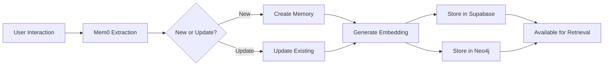
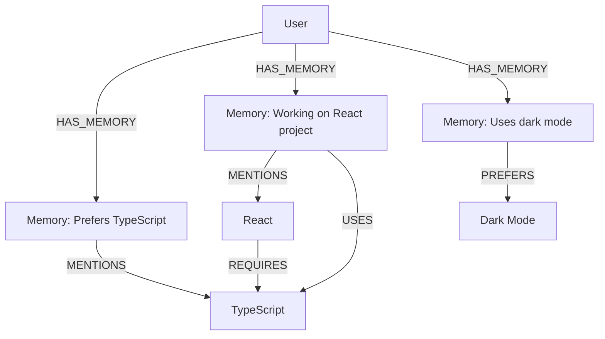

## Overview

Tabby's memory system is what makes it truly intelligent. Instead of starting from scratch every conversation, it **remembers your preferences, coding style, past interactions, and context** to provide increasingly personalized assistance.

The memory layer is powered by **Mem0** with a hybrid storage architecture:

<CardGroup cols={3}>
  <Card title="Mem0" icon="brain">
    Intelligent memory extraction and retrieval
  </Card>
  <Card title="Supabase" icon="database">
    Vector embeddings for semantic search
  </Card>
  <Card title="Neo4j" icon="project-diagram">
    Knowledge graph for relationships (optional)
  </Card>
</CardGroup>

## What is Mem0?

**Mem0** is an intelligent memory layer for AI applications that automatically:

1. **Extracts facts** from conversations ("User prefers dark mode")
2. **Stores embeddings** for semantic search
3. **Retrieves relevant memories** based on context
4. **Updates existing memories** instead of duplicating
5. **Tracks memory history** and changes over time

<Info>
  Think of Mem0 as giving your AI a long-term memory system, similar to how humans remember context from past conversations.
</Info>

### Memory Lifecycle



## Architecture Components

### 1. Memory Backend (FastAPI)

The memory service runs as a separate **FastAPI server** on port 8000:

```python
# backend/main.py
from mem0 import Memory
from fastapi import FastAPI

app = FastAPI(title="Memory API")

config = {
    "llm": {
        "provider": "openai",
        "config": {
            "model": "gpt-4.1-nano-2025-04-14",
            "enable_vision": True,  # For image memories
        }
    },
    "vector_store": {
        "provider": "supabase",
        "config": {
            "connection_string": supabase_connection_string,
            "collection_name": "memories",
            "index_method": "hnsw",
            "index_measure": "cosine_distance"
        }
    },
    "graph_store": {
        "provider": "neo4j",
        "config": {
            "url": neo4j_url,
            "username": neo4j_username,
            "password": neo4j_password,
        }
    }
}

memory = Memory.from_config(config)
```

**Why Separate Service?**

<AccordionGroup>
  <Accordion title="Language Compatibility">
    Mem0 is a Python library. The FastAPI service acts as a bridge to the JavaScript/TypeScript frontend.
  </Accordion>
  
  <Accordion title="Scalability">
    Memory operations can be resource-intensive. Running as a separate service allows independent scaling.
  </Accordion>
  
  <Accordion title="Isolation">
    Crashes in the memory service don't affect the main Electron app.
  </Accordion>
</AccordionGroup>

### 2. Supabase Vector Store

Supabase stores **vector embeddings** of memories for semantic search.

**Database Schema:**

```sql
CREATE TABLE memories (
  id UUID PRIMARY KEY,
  user_id TEXT NOT NULL,
  memory TEXT NOT NULL,
  hash TEXT UNIQUE,
  metadata JSONB,
  created_at TIMESTAMP DEFAULT NOW(),
  updated_at TIMESTAMP DEFAULT NOW(),
  embedding VECTOR(1536)  -- OpenAI ada-002 dimensions
);

-- HNSW index for fast vector search
CREATE INDEX ON memories 
USING hnsw (embedding vector_cosine_ops);
```

**Vector Search:**

```sql
-- Find similar memories using cosine similarity
CREATE FUNCTION match_memories(
  query_embedding VECTOR(1536),
  match_threshold FLOAT,
  match_count INT,
  filter_user_id TEXT
)
RETURNS TABLE (
  id UUID,
  memory TEXT,
  similarity FLOAT
)
AS $$
  SELECT id, memory, 1 - (embedding <=> query_embedding) AS similarity
  FROM memories
  WHERE user_id = filter_user_id
    AND 1 - (embedding <=> query_embedding) > match_threshold
  ORDER BY similarity DESC
  LIMIT match_count;
$$ LANGUAGE SQL;
```

**Why HNSW Index?**

<Tip>
  HNSW (Hierarchical Navigable Small World) is a graph-based algorithm for approximate nearest neighbor search. It's **much faster** than brute-force vector search with minimal accuracy loss.
</Tip>

- **Speed**: Sub-millisecond queries even with 100k+ memories
- **Accuracy**: 95%+ recall compared to exact search
- **Scalability**: Handles millions of vectors efficiently

### 3. Neo4j Knowledge Graph (Optional)

Neo4j creates a **visual knowledge graph** showing relationships between memories.

**Graph Schema:**

```cypher
// Node: Memory
CREATE (m:Memory {
  id: "uuid",
  content: "User prefers TypeScript",
  type: "LONG_TERM",
  created_at: datetime()
})

// Node: Entity (extracted from memories)
CREATE (e:Entity {
  name: "TypeScript",
  type: "TECHNOLOGY"
})

// Relationship
CREATE (m)-[:MENTIONS]->(e)
```

**Example Graph:**



**Visualization in Brain Panel:**

```typescript
import NVL from '@neo4j-nvl/react';

const MemoryGraph = ({ userId }: { userId: string }) => {
  const [graphData, setGraphData] = useState({ nodes: [], rels: [] });
  
  // Fetch Neo4j data
  useEffect(() => {
    fetch(`/api/memory/graph?userId=${userId}`)
      .then(res => res.json())
      .then(data => setGraphData(data));
  }, [userId]);
  
  return (
    <NVL 
      nodes={graphData.nodes} 
      rels={graphData.rels}
      style={{ width: '100%', height: '600px' }}
    />
  );
};
```

## Memory Types

Tabby classifies memories into **5 types** using LLM-based classification:

<CardGroup cols={2}>
  <Card title="LONG_TERM" icon="infinity">
    **Permanent facts and preferences**
    
    Examples:
    - "User prefers dark mode"
    - "My name is John"
    - "I like pizza"
    - "I'm a software engineer"
  </Card>
  
  <Card title="SHORT_TERM" icon="clock">
    **Temporary states and current activities**
    
    Examples:
    - "Currently working on auth feature"
    - "Right now debugging a bug"
    - "Need to finish this today"
    - "In a meeting"
  </Card>
  
  <Card title="EPISODIC" icon="calendar">
    **Past events with time context**
    
    Examples:
    - "Yesterday I had a meeting"
    - "Last week I deployed v2"
    - "Met John at conference"
    - "Fixed the bug on Monday"
  </Card>
  
  <Card title="SEMANTIC" icon="book">
    **General knowledge and facts**
    
    Examples:
    - "Python uses indentation"
    - "Capital of France is Paris"
    - "React is a JS library"
    - "HTTP 404 means Not Found"
  </Card>
  
  <Card title="PROCEDURAL" icon="list-check">
    **How-to knowledge and processes**
    
    Examples:
    - "To deploy, run npm build"
    - "First boil water, then add pasta"
    - "Steps to create PR: commit, push, open PR"
  </Card>
</CardGroup>

### Classification System

**LLM-Based Classifier:**

```python
class MemoryClassifier:
    CLASSIFICATION_PROMPT = """Classify the following memory into ONE type:
    
    - SHORT_TERM: Temporary states, current activities ("currently working on...")
    - LONG_TERM: Permanent preferences, identity ("I prefer...", "My name is...")
    - EPISODIC: Past events with time ("yesterday", "last week")
    - SEMANTIC: General knowledge ("Python uses...", "Capital of...")
    - PROCEDURAL: How-to instructions ("To do X, first...")
    
    Memory: {content}
    """
    
    def classify(self, content: str) -> str:
        response = openai.chat.completions.create(
            model="gpt-4.1-nano-2025-04-14",
            messages=[{
                "role": "user",
                "content": self.CLASSIFICATION_PROMPT.format(content=content)
            }],
            max_tokens=20,
            temperature=0
        )
        return response.choices[0].message.content.strip().upper()
```

**Automatic Classification:**

```python
@app.post("/memory/add")
async def add_memory(request: AddMemoryRequest):
    metadata = request.metadata or {}
    
    # Auto-classify if enabled
    if request.auto_classify and "memory_type" not in metadata:
        content = " ".join([m.content for m in request.messages])
        memory_type = classifier.classify(content)
        metadata["memory_type"] = memory_type
    
    result = memory.add(
        messages=[{"role": m.role, "content": m.content} for m in request.messages],
        user_id=request.user_id,
        metadata=metadata
    )
    
    return {"success": True, "result": result, "classified_type": metadata.get("memory_type")}
```

## API Endpoints

The Memory API exposes RESTful endpoints:

### Add Memory

```typescript
POST /memory/add

{
  "messages": [
    { "role": "user", "content": "I prefer using TypeScript" },
    { "role": "assistant", "content": "I'll remember that you prefer TypeScript" }
  ],
  "user_id": "user_123",
  "metadata": {
    "source": "chat",
    "memory_type": "LONG_TERM"  // Optional, will auto-classify if not provided
  },
  "auto_classify": true
}

Response:
{
  "success": true,
  "result": {
    "memories": [
      {
        "id": "mem_abc123",
        "memory": "User prefers using TypeScript for development",
        "user_id": "user_123",
        "metadata": { "memory_type": "LONG_TERM" }
      }
    ]
  },
  "classified_type": "LONG_TERM"
}
```

### Search Memories

```typescript
POST /memory/search

{
  "query": "What programming languages do I use?",
  "user_id": "user_123",
  "limit": 10,
  "memory_type": "LONG_TERM"  // Optional filter
}

Response:
{
  "success": true,
  "results": [
    {
      "id": "mem_abc123",
      "memory": "User prefers using TypeScript for development",
      "score": 0.92,
      "metadata": { "memory_type": "LONG_TERM" }
    },
    {
      "id": "mem_def456",
      "memory": "User is currently learning Python",
      "score": 0.85,
      "metadata": { "memory_type": "SHORT_TERM" }
    }
  ]
}
```

### Get All Memories

```typescript
POST /memory/get_all

{
  "user_id": "user_123",
  "memory_type": "LONG_TERM"  // Optional filter
}

Response:
{
  "success": true,
  "memories": [
    {
      "id": "mem_abc123",
      "memory": "User prefers TypeScript",
      "created_at": "2026-01-15T10:30:00Z",
      "updated_at": "2026-01-15T10:30:00Z",
      "metadata": { "memory_type": "LONG_TERM" }
    }
  ]
}
```

### Add Image Memory

```typescript
POST /memory/add_image

{
  "image_url": "data:image/png;base64,iVBORw0KGgoAAAANS...",
  "context": "Screenshot from my coding interview",
  "user_id": "user_123",
  "metadata": {
    "source": "screen_capture"
  },
  "auto_classify": true
}

Response:
{
  "success": true,
  "result": {
    "memories": [
      {
        "id": "mem_img789",
        "memory": "User was solving a binary tree problem during a coding interview",
        "metadata": { 
          "memory_type": "EPISODIC",
          "source": "screen_capture"
        }
      }
    ]
  },
  "classified_type": "EPISODIC"
}
```

### Update Memory

```typescript
PUT /memory/update

{
  "memory_id": "mem_abc123",
  "data": "User prefers TypeScript and Python"
}
```

### Delete Memory

```typescript
DELETE /memory/{memory_id}

Response:
{
  "success": true,
  "result": "Memory deleted successfully"
}
```

### Memory History

```typescript
GET /memory/history/{memory_id}

Response:
{
  "success": true,
  "history": [
    {
      "id": "hist_1",
      "memory_id": "mem_abc123",
      "old_value": "User prefers TypeScript",
      "new_value": "User prefers TypeScript and Python",
      "updated_at": "2026-01-20T14:00:00Z"
    }
  ]
}
```

## Integration with Tabby

### Automatic Context Capture

Tabby automatically captures context and stores it as memories:

**1. Periodic Screenshots (Interview Mode):**

```typescript
// electron/src/services/context-capture.ts
setInterval(async () => {
  const screenshot = await captureScreen();
  const imageUrl = await uploadToSupabase(screenshot);
  
  // Send to memory API
  await fetch(`${MEMORY_API_URL}/memory/add_image`, {
    method: 'POST',
    body: JSON.stringify({
      image_url: imageUrl,
      context: 'Auto-captured coding session',
      user_id: currentUserId,
      metadata: { source: 'auto_capture' }
    })
  });
}, 60000); // Every minute during active coding
```

**2. Conversation Memory:**

```typescript
// After AI chat interaction
const addMemory = async (messages: Message[], userId: string) => {
  const response = await fetch(`${MEMORY_API_URL}/memory/add`, {
    method: 'POST',
    headers: { 'Content-Type': 'application/json' },
    body: JSON.stringify({
      messages: messages.map(m => ({ role: m.role, content: m.content })),
      user_id: userId,
      metadata: { source: 'chat' },
      auto_classify: true
    })
  });
  
  return response.json();
};
```

**3. User Preference Tracking:**

```typescript
// When user changes settings
const trackPreference = async (preference: string, value: any) => {
  await fetch(`${MEMORY_API_URL}/memory/add`, {
    method: 'POST',
    body: JSON.stringify({
      messages: [
        { role: 'user', content: `I prefer ${preference} to be ${value}` }
      ],
      user_id: currentUserId,
      metadata: { 
        source: 'settings',
        memory_type: 'LONG_TERM'
      }
    })
  });
};
```

### Memory Retrieval in AI Context

**Enhancing AI Responses with Memories:**

```typescript
// nextjs-backend/src/app/api/chat/route.ts
export async function POST(req: Request) {
  const { messages, userId } = await req.json();
  
  // 1. Search for relevant memories
  const lastUserMessage = messages[messages.length - 1].content;
  const memoryResponse = await fetch(`${MEMORY_API_URL}/memory/search`, {
    method: 'POST',
    body: JSON.stringify({
      query: lastUserMessage,
      user_id: userId,
      limit: 5
    })
  });
  
  const { results: memories } = await memoryResponse.json();
  
  // 2. Build context with memories
  const systemPrompt = `You are Tabby, an AI assistant.
  
Relevant memories about the user:
${memories.map(m => `- ${m.memory}`).join('\n')}

Use these memories to personalize your response.`;
  
  // 3. Stream response with context
  const result = streamText({
    model: openai('gpt-4-turbo'),
    messages: [
      { role: 'system', content: systemPrompt },
      ...messages
    ]
  });
  
  return result.toDataStreamResponse();
}
```

## Brain Panel UI

The **Brain Panel** (`Ctrl+Shift+B`) provides a visual interface for memory management:

<Frame>
  
</Frame>

**Features:**

<Tabs>
  <Tab title="Memory List">
    - View all memories by type (LONG_TERM, SHORT_TERM, etc.)
    - Search and filter memories
    - Edit or delete individual memories
    - See memory scores and relevance
  </Tab>
  
  <Tab title="Knowledge Graph">
    - Interactive Neo4j visualization
    - Explore relationships between memories
    - Click nodes to see details
    - Zoom and pan the graph
  </Tab>
  
  <Tab title="Image Uploads">
    - Upload images for visual memory
    - Drag & drop support
    - Automatic vision-based extraction
    - Preview uploaded images
  </Tab>
  
  <Tab title="Statistics">
    - Total memories count
    - Memories by type breakdown
    - Most referenced entities
    - Memory growth over time
  </Tab>
</Tabs>

## Performance Optimization

### Memory Search Caching

```typescript
import { LRUCache } from 'lru-cache';

const memoryCache = new LRUCache<string, any>({
  max: 500,  // Store up to 500 searches
  ttl: 1000 * 60 * 5,  // 5 minute TTL
});

const searchMemories = async (query: string, userId: string) => {
  const cacheKey = `${userId}:${query}`;
  
  if (memoryCache.has(cacheKey)) {
    return memoryCache.get(cacheKey);
  }
  
  const results = await fetch(`${MEMORY_API_URL}/memory/search`, {
    method: 'POST',
    body: JSON.stringify({ query, user_id: userId })
  }).then(r => r.json());
  
  memoryCache.set(cacheKey, results);
  return results;
};
```

### Batching Memory Additions

```typescript
// Queue memories and batch insert every 5 seconds
const memoryQueue: Message[][] = [];

setInterval(async () => {
  if (memoryQueue.length === 0) return;
  
  const batch = memoryQueue.splice(0, memoryQueue.length);
  
  await Promise.all(
    batch.map(messages => 
      fetch(`${MEMORY_API_URL}/memory/add`, {
        method: 'POST',
        body: JSON.stringify({ messages, user_id: currentUserId })
      })
    )
  );
}, 5000);
```

## Privacy & Data Control

<Warning>
  All memories are stored **locally** in your Supabase instance. No data is sent to external servers (except AI provider APIs for processing).
</Warning>

**User Data Isolation:**

- Every memory tagged with `user_id`
- Queries filtered by `user_id` (no cross-user leakage)
- Users can delete all their memories via UI

**Data Deletion:**

```typescript
// Delete all user memories
DELETE /memory/user/{user_id}

// Or via Supabase directly
supabase
  .from('memories')
  .delete()
  .eq('user_id', userId);
```

## Advanced Features

### Memory Deduplication

Mem0 automatically **deduplicates** similar memories:

```python
# If you add:
"User prefers dark mode"

# Then later add:
"I like dark themes"

# Mem0 will UPDATE the existing memory instead of creating a duplicate:
"User prefers dark mode and dark themes"
```

This is done via **content hashing** and **semantic similarity** checks.

### Memory Versioning

Every memory update is tracked:

```typescript
const history = await fetch(`${MEMORY_API_URL}/memory/history/mem_abc123`)
  .then(r => r.json());

// Shows:
// v1: "User prefers TypeScript"
// v2: "User prefers TypeScript and Python"
// v3: "User is an expert in TypeScript and Python"
```

### Cross-Session Context

Memories persist across:
- App restarts
- Different windows (Action Menu, Brain Panel, etc.)
- Different features (Chat, Interview Copilot, Suggestions)

This creates a **unified user experience** where the AI truly knows you.

## Troubleshooting

<AccordionGroup>
  <Accordion title="Memory API not starting">
    **Check:**
    1. Python 3.12+ installed
    2. `uv sync` ran successfully
    3. `.env` file has `SUPABASE_CONNECTION_STRING`
    4. Supabase is running (`npx supabase status`)
    
    **Fix:**
    ```bash
    cd backend
    uv sync
    uv run main.py
    ```
  </Accordion>
  
  <Accordion title="Memories not being retrieved">
    **Check:**
    1. User ID is consistent across requests
    2. Vector embeddings are being generated (check Supabase)
    3. HNSW index is created on `embedding` column
    
    **Debug:**
    ```sql
    -- Check if memories exist
    SELECT * FROM memories WHERE user_id = 'your_user_id';
    
    -- Check if embeddings are present
    SELECT id, memory, embedding IS NOT NULL as has_embedding
    FROM memories;
    ```
  </Accordion>
  
  <Accordion title="Neo4j not showing relationships">
    **Check:**
    1. Neo4j credentials in `.env` are correct
    2. Neo4j instance is running and accessible
    3. Graph store is enabled in Mem0 config
    
    **Test connection:**
    ```python
    from neo4j import GraphDatabase
    
    driver = GraphDatabase.driver(
        uri=neo4j_url,
        auth=(neo4j_username, neo4j_password)
    )
    
    with driver.session() as session:
        result = session.run("MATCH (n) RETURN count(n)")
        print(result.single()[0])  # Should print node count
    ```
  </Accordion>
</AccordionGroup>

## Next Steps

<CardGroup cols={2}>
  <Card title="System Architecture" icon="sitemap" href="/concepts/architecture">
    See how memory fits into the overall system
  </Card>
  <Card title="Technology Stack" icon="layer-group" href="/concepts/tech-stack">
    Learn about Mem0 and other technologies used
  </Card>
</CardGroup>